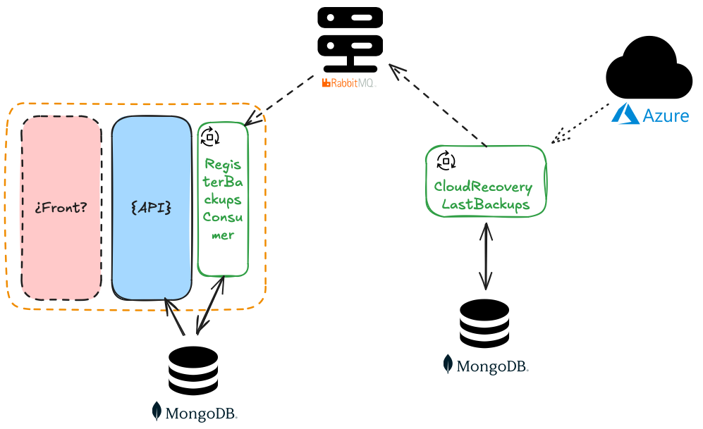

# Cloud Monitor Application

Esta aplicación es un proyecto de aprendizaje diseñado para explorar la arquitectura de microservicios. Gestiona y recupera información de backups de máquinas virtuales en Azure utilizando diversos componentes y tecnologías.

Para su implementación se ha usado la metodología TDD que nos indica que hemos de hacer 1 prueba, después hacer que pase y a continuación refactorizar. Seguiremos con la siguiente prueba.

**Nota:** Si alguien se lo descarga y le resulta de utilidad, pues **¡¡mejor que mejor!!**

## Aprendizajes

### CloudRecoveryLastBackups

- He tenido que reestructurarme en la cabeza el patrón criteria, definía mal los filtros.
- He aprendido la nueva manera de usar Entity Framework (desde la definición en código de las entidades)
- A usar MongoDB, cuando creía que había acabado he tenido que crear una clase de Entidad para poder soportar adecuadamente una clave primaria (¡No sabía que había claves primarias en base de datos no SQL!)
- Me ha costado mucho entender los conceptos de Exchange y Colas de RabbitMQ, ahora ya tiene sentido!!

### RegisterBackupsConsumer

- Me ha costado encajar Exchange, Colas y RoutingKey. Ahora el Exchange de tipo Topic tiene sentido!!!
- Reflexión: Encontrar e interactuar con clases en tiempo de ejecución sin tener una referencia directa a ellas. Por tanto ahora ya puedo:
  - Buscar todas las clases que implementen una interfaz _(útil para localizar los Subscriptores)_
  - Instanciar dichas clases
  - Invocar un método concreto, atributo y clase genérica que tienes definido _(útil para encontrar el DomainEvent y saber el nombre del evento o RoutingKey al que te quieres subscribir)_
  - Cambiar valores de propiedades públicas
  - Incluso cambiar valores de propiedades de sólo lectura y privadas _(¡Cuidado con esto!!! sólo lo he usado para las pruebas automáticas, concretamente para poder lanzar las pruebas de RabbitMQ de manera paralela)_

## Estado del desarrollo

Componentes:

- SystemAdministraor:
  - Front: _To do_
  - API: **DONE**
  - RegisterBackupsConsumer: **DONE**
- Clouds
  - CloudRecoveryLastBackups: **DONE**

## Tecnologías Utilizadas

- .NET Core 8 (para las aplicaciones de consola y API)
- MongoDB
- RabbitMQ
- Azure

## Arquitectura

Para crear esta aplicación se han usado las siguientes arquitecturas y patrones de diseño:

- Arquitectura Hexagonal
- Patrón de diseño DDD
- CQRS
- Patrón Repository
- Patrón Criteria o Specification

La aplicación consta de los siguientes componentes principales:

1. **Aplicación Principal**

   - Frontend: Interfaz de usuario de la aplicación
   - API: Maneja las solicitudes del frontend
   - RegisterBackupsConsumer: Aplicación de consola que se suscribe a y procesa actualizaciones de backups

2. **Base de Datos**

   - MongoDB: Almacena datos de la aplicación

3. **Mensajería**

   - RabbitMQ: Sistema de mensajería para la comunicación entre servicios

4. **Servicios en la Nube**
   - CloudRecoveryLastBackups: Aplicación de consola que recupera información de backups de Azure
   - Azure: Plataforma donde se almacenan los backups de las máquinas virtuales



## Funcionamiento

1. CloudRecoveryLastBackups recupera la información de los últimos backups de las máquinas de un Tenant en Azure.
2. Esta información se transmite a través de RabbitMQ.
3. LastBackupSuscribers se suscribe a estos datos de backups a través de RabbitMQ.
4. LastBackupSuscribers procesa los datos recibidos, realizando las operaciones necesarias con la información de los backups.
5. La API accede a los datos procesados según sea necesario.
6. El Frontend muestra la información procesada al usuario.

## Configuración y Uso

### CloudBackupsRecovery

Para configurar y ejecutar la aplicación **"CloudBackupsRecovery"**, sigue estos pasos:

1. Clona el repositorio en tu máquina local.
2. Asegúrate de tener instaladas todas las dependencias necesarias (.NET, MongoDB, RabbitMQ).
3. Crea un archivo `appsettings.json` en el directorio raíz del proyecto con la siguiente configuración:

```json
{
  "EnvironmentVariables": [
    {
      "key": "AZURE_CLIENT_ID",
      "value": ""
    },
    {
      "key": "AZURE_TENANT_ID",
      "value": ""
    },
    {
      "key": "AZURE_CLIENT_SECRET",
      "value": ""
    }
  ],
  "Suscriptions": [
    {
      "Id": "",
      "ResourcesGroups": [
        {
          "Name": "",
          "Vaults": [
            {
              "Name": ""
            }
          ]
        }
      ]
    },
    {
      "Id": "",
      "ResourcesGroups": [
        {
          "Name": "",
          "Vaults": [
            {
              "Name": ""
            }
          ]
        }
      ]
    }
  ],
  "MongoDBSettings": {
    "MongoDBURI": "",
    "DatabaseName": ""
  },
  "RabbitMQ": {
    "HostName": "",
    "UserName": "",
    "Password": "",
    "Port": 0,
    "ExchangeName": ""
  }
}
```

4. Completa los campos vacíos en el archivo `appsettings.json` con tus propios valores:

   - Credenciales de Azure (AZURE_CLIENT_ID, AZURE_TENANT_ID, AZURE_CLIENT_SECRET)
   - Detalles de las suscripciones, grupos de recursos y vault de Azure
   - Configuración de MongoDB (URI y nombre de la base de datos)
   - Configuración de RabbitMQ (host, usuario, contraseña, puerto, etc.)

### RegisterBackupsConsumer

Para configurar y ejecutar la aplicación **"RegisterBackupsConsumer"**, sigue estos pasos:

1. Clona el repositorio en tu máquina local.
2. Asegúrate de tener instaladas todas las dependencias necesarias (.NET, MongoDB, RabbitMQ).
3. Crea un archivo `appsettings.json` en el directorio raíz del proyecto con la siguiente configuración:

```json
{
  "MongoDBSettings": {
    "MongoDBURI": "",
    "DatabaseName": ""
  },
  "RabbitMQ": {
    "HostName": "",
    "UserName": "",
    "Password": "",
    "Port": 0,
    "DeliveryLimit": 0,
    "ExchangeName": ""
  }
}
```

4. Completa los campos vacíos en el archivo `appsettings.json` con tus propios valores:

- Configuración de MongoDB (URI y nombre de la base de datos)
- Configuración de RabbitMQ (host, usuario, contraseña, puerto, etc.)
  - _El Exchange, Queue y su RoutingKey serán creado la primera vez que se conecte a RabbitMQ si no existe_

Asegúrate de no compartir tus credenciales o información sensible. El archivo `appsettings.json` debe estar incluido en el `.gitignore` para evitar que se suba al repositorio.

### Web API

Para configurar y ejecutar la aplicación **"RegisterBackupsConsumer"**, sigue estos pasos:

1. Clona el repositorio en tu máquina local.
2. Asegúrate de tener instaladas todas las dependencias necesarias (.NET y MongoDB).
3. Crea un archivo `appsettings.json` en el directorio raíz del proyecto con la siguiente configuración:

```json
{
  "MongoDBSettings": {
    "MongoDBURI": "",
    "DatabaseName": ""
  }
}
```

4. Completa los campos vacíos en el archivo `appsettings.json` con tus propios valores:

- Configuración de MongoDB (URI y nombre de la base de datos)

Asegúrate de no compartir tus credenciales o información sensible. El archivo `appsettings.json` debe estar incluido en el `.gitignore` para evitar que se suba al repositorio.

## Contribución

Este proyecto no admite contribuciones de momento dado que su implementación es puramente didactica.

## Licencia

[GNU GENERAL PUBLIC LICENSE](./LICENSE)
